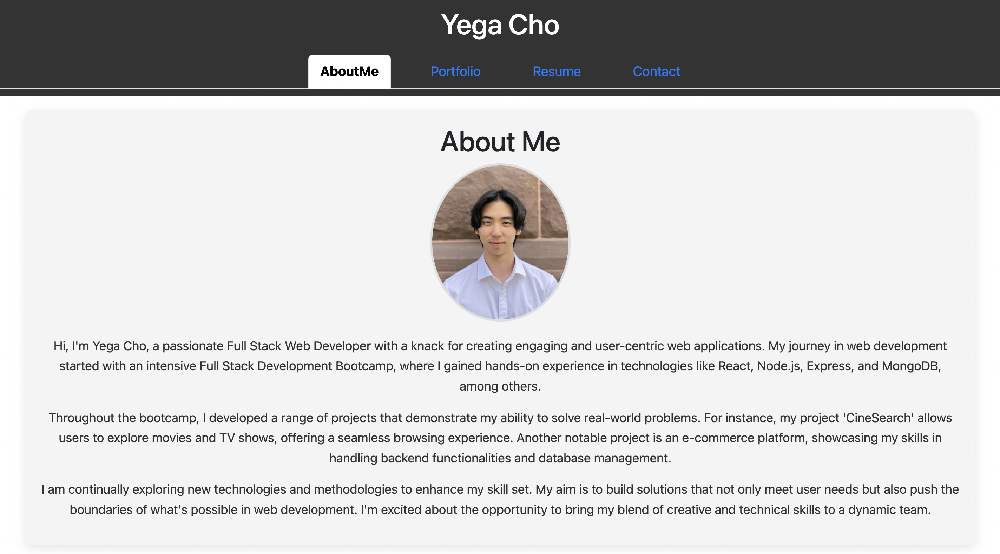
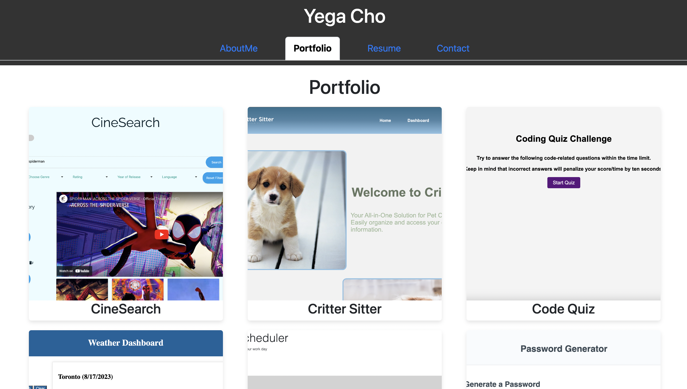
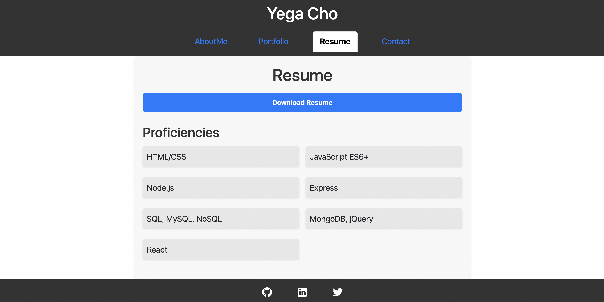
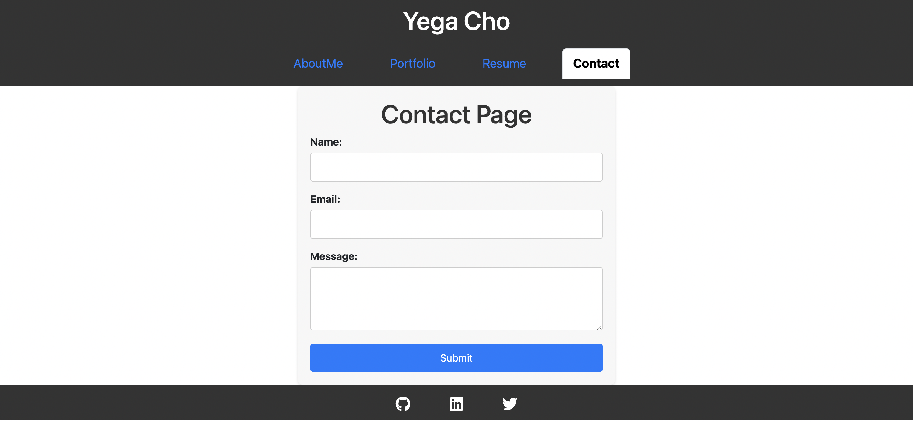

# Text Editor Starter Code

## Link to Deployed Application

<a href="https://yega-cho-portfolio.netlify.app">Yega Cho's Portfolio</a>

## Description

- This portfolio is designed to showcase my web development skills. 
- Built using React, this portfolio highlights a range of projects, each demonstrating proficiency in various aspects of full-stack web development. 
- The portfolio is structured into multiple sections including About Me, Portfolio, Resume, and Contact, each accessible via a responsive navigation menu.
- The portfolio's design is modern and user-friendly, ensuring a seamless browsing experience across different devices.

Key Features:
- Portfolio: The Portfolio section displays selected projects with images, descriptions, and links to live deployments and source code repositories.
- Resume: The Resume section provides a downloadable link to a comprehensive resume, detailing skills, experiences, and proficiencies.
- Contact Form: The Contact section includes a form, allowing potential employers or collaborators to easily reach out.

## Usage

Browsing the Portfolio
- Navigation: Use the navigation bar at the top of the page to switch between different sections of the portfolio.
- About Me: Learn about my background, skills, and experiences in web development.
- Portfolio: Explore a showcase of projects with descriptions, images, and links to live sites and GitHub repositories.
- Resume: Download a detailed resume and view a list of technical proficiencies.
- Contact: Fill out the contact form to get in touch with me for potential opportunities or inquiries.

## Installation

- Clone the repository to your local machine.
- Run npm install in the root directory to install all dependencies.
- Use npm run dev to start the server.

## Screenshot of the Website

## Contribution

N/A

## Tests

N/A

## License

This project is covered under the [MIT](https://opensource.org/licenses/MIT) license.

## Questions

For any questions, please reach out to me at the following:

- [GitHub Profile](https://github.com/yega1009)
- Email: yega1009@gmail.com
